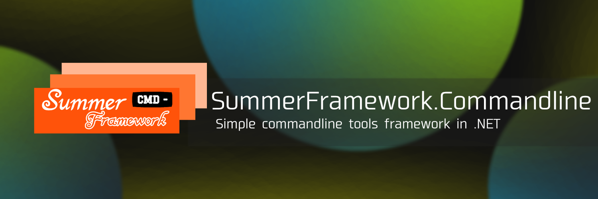

# SummerFramework.Commandline

为.NET开发者准备的命令行工具开发框架

README语言: [English (英语)](../README.md) | 简体中文 (当前)

文档: [English](../docs/en_us.md) | [简体中文](../docs/zh_cn.md)

## 特性

- 简单易用且轻量。
- 功能强大且易于理解。
- 仅需一行代码即可运行。